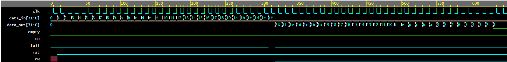
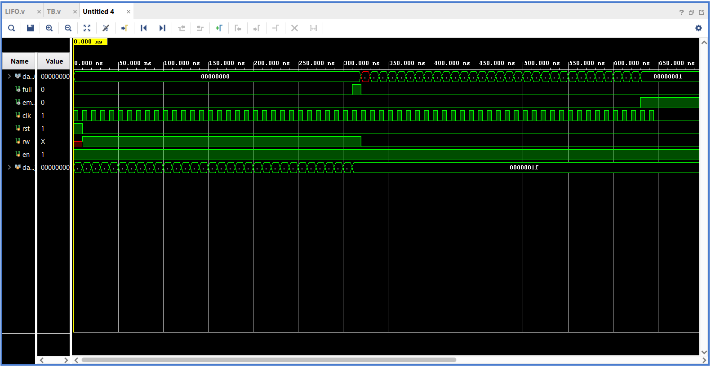
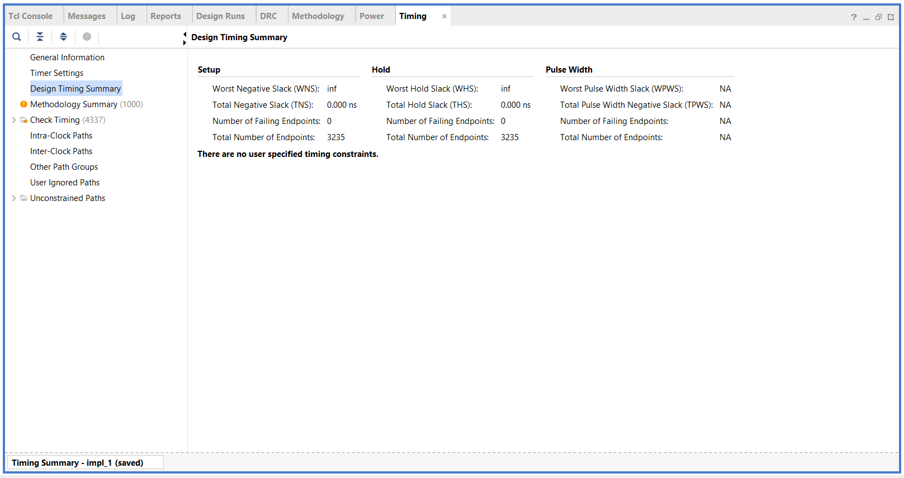
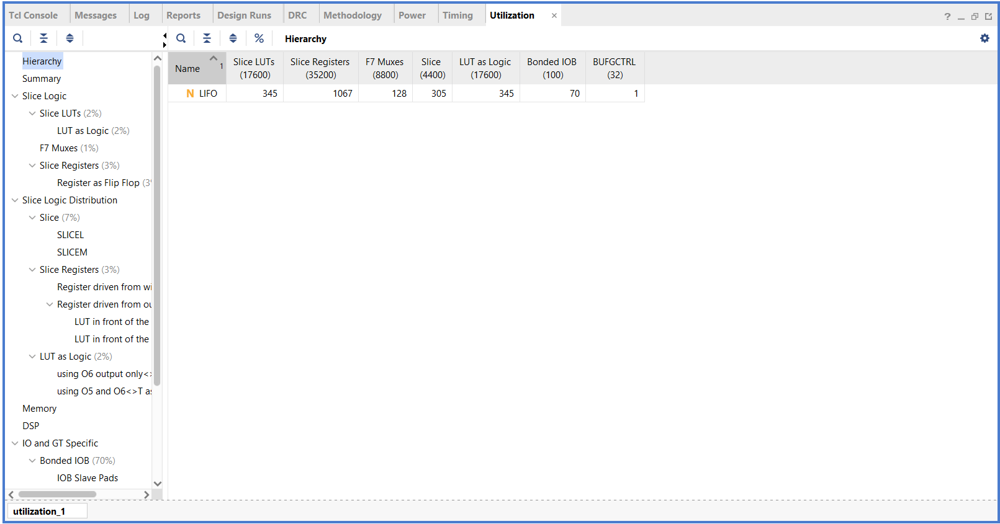
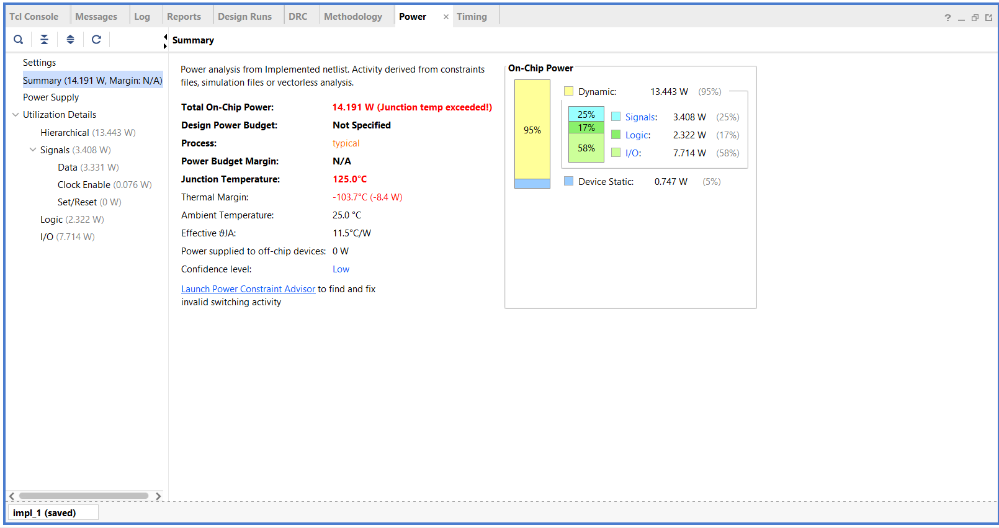

# LIFO (Last-In-First-Out) Stack — Verilog Design

A 32-bit wide, 32-deep LIFO (stack) memory implemented in Verilog HDL, verified with two testbenches, and synthesized/analyzed in Xilinx Vivado (ISE flow).

## Overview

LIFO (Last-In, First-Out) is a stack-based memory access pattern — the most recently written data is the first to be read out, like a stack of plates. This project implements a synchronous LIFO with:

- 32 x 32-bit internal memory array
- Synchronous write (push) and read (pop) control via `rw` and `en`
- `full` / `empty` status flags
- Active-high synchronous reset

## Files

| File | Description |
|---|---|
| `lifo.v` | LIFO stack design (RTL) |
| `lifo_tb_basic.v` | Simple self-checking testbench — pushes 31 values, pops them all back, checks LIFO order. This is the one used to produce the PASS/FAIL results and waveform in the lab report. |
| `lifo_tb_extended.v` | More thorough testbench — 9 test cases covering enable toggling, reset, overflow, underflow, back-to-back write/read, boundary conditions, a sustained stress test, and a timing test |

## Port Description

| Port | Direction | Width | Description |
|---|---|---|---|
| `clk` | input | 1 | Clock |
| `rst` | input | 1 | Synchronous, active-high reset |
| `en` | input | 1 | Enable — must be high for read/write to occur |
| `rw` | input | 1 | `1` = write (push), `0` = read (pop) |
| `data_in` | input | 32 | Data to push onto the stack |
| `data_out` | output | 32 | Data popped from the stack |
| `full` | output | 1 | High when the stack has 32 elements |
| `empty` | output | 1 | High when the stack has 0 elements |

## A quirk worth knowing about this design

Reads use a nonblocking assignment (`data_out <= mem[sp]`) in the same cycle that `sp` itself gets decremented, so `data_out` is driven from `sp`'s value *before* that decrement takes effect. Net effect: **the first pop right after switching from write to read always comes back stale** — it reads one slot above the real top of the stack. The second pop onward reads correctly, for as long as you keep popping without switching back to write.

This is why both testbenches include a throwaway pop cycle before checking the real result. `lifo_tb_extended.v` has comments at each spot where this matters.

One more consequence: reset sets `sp = 1`, not `0`, so the `empty` flag doesn't go high immediately after reset — only once the stack has actually been popped down to zero during normal use.

## How to Simulate

**Using Icarus Verilog:**
```bash
# basic testbench
iverilog -o basic.vvp lifo.v lifo_tb_basic.v
vvp basic.vvp

# extended testbench
iverilog -o extended.vvp lifo.v lifo_tb_extended.v
vvp extended.vvp
```
Both produce PASS/FAIL output per check. The basic testbench also generates a `dump.vcd` waveform file (viewable in GTKWave).

**Using Xilinx Vivado/ISE:**
1. Add `lifo.v` as a design source and whichever testbench as a simulation source
2. Run Behavioral Simulation to view waveforms
3. Run Synthesis and Implementation to generate timing, utilization, and power reports

## Vivado Results

Design was synthesized and implemented in Vivado. Reports below (from the basic testbench run):

**Output Waveform (simulation console)**


**ISim Simulation Waveform**


**Timing Report**


**Utilization Report**


**Power Report**


## Results

- Designed and verified a 32x32 LIFO stack in Verilog
- Basic testbench: all 31 data checks + empty flag check pass
- Extended testbench: all 9 test cases pass (enable toggling, reset, overflow, underflow, write/read switching, boundary, stress, timing)
- Synthesized in Vivado with reports generated for timing, area (utilization), and power

## Background

This project was completed as part of a Hardware Design / Digital Design lab exercise.
